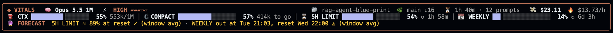

# cc-vitals

**A Claude Code mod that puts your session's vitals in a framed live dashboard above the prompt — in the terminal and in the desktop app's Code tab. Light by design: it draws what Claude Code already hands it and runs anything slow rarely, in the background.**

Model and reasoning effort, context and plan limits, cost and burn rate, tokens and cache per turn and session, auto-compaction, every subagent with its own model and effort, background shells, the tool running right now, and your weekly and monthly spend.

```
╭──────────────────────────────────────────────────────────────────────────────────────────────────────────────────────────────────────────╮
│ ◆ VITALS   🧠 Opus 5.5 1M   ⚡ HIGH ▰▰▰▱▱                     📁 cc-vitals  🌿 main ↓7   ⏳ 1h 20m · 7 prompts   💸 $16.18  🔥 $12.11/h │
│ ⛽ CTX ████████▊░░░░░░░░ 44% 435k/1M │ 🗜 COMPACT █████████▏░░░░░░░ 45% 532k to go │ ⏳ 5H LIMIT ███████▏░░░░░░░░ 45% ↻ 2h 19m │ 📅 WEEKLY ██▏░░░░ 13% ↻ 6d 4h │
│ 🔮 FORECAST  5H LIMIT out at 14:05, reset 15:30 ⚠ (last hour) · WEEKLY ≈ 61% at reset ✓ (window avg)                                  │
╰──────────────────────────────────────────────────────────────────────────────────────────────────────────────────────────────────────────╯
╭─────────────────────────────────────────────────────────────────╮  ╭─────────────────────────────────────────────────────────────────╮
│ 🔥 TOKENS                     🧊 cache warm · expires in 54m     │  │ 🤖 AGENTS                               1 running · 2 done      │
│         │   IN │  OUT │ CACHE R │ CACHE W │  HIT │  TOTAL │ NOTE │  │   │ AGENT           │ MODEL       │ EFFORT │ TOKENS │  HIT │ TIME  │
│ ────────┼──────┼──────┼─────────┼─────────┼──────┼────────┼───── │  │ ──┼─────────────────┼─────────────┼────────┼────────┼──────┼────── │
│ turn    │   22 │  19k │    4.7M │     24k │  99% │   4.7M │ 3m56 │  │ ◆ │ main            │ Opus 5.5 1M │ high   │  18.5M │  99% │ 1h 20 │
│ session │   98 │  99k │   18.2M │    143k │  99% │  18.5M │ 2 tu │  │ ⠋ │ Review the diff │ Sonnet 5.5  │ medium │    47k │  87% │ 1m20s │
╰─────────────────────────────────────────────────────────────────╯  │ ✓ │ Explore auth    │ Haiku 5.5   │ low    │    12k │  88% │   40s │
╭─────────────────────────────────────────────────────────────────╮  ╰─────────────────────────────────────────────────────────────────╯
│ 📊 USAGE                                      ccusage · 9m ago   │  ╭─────────────────────────────────────────────────────────────────╮
│ PERIOD │  COST │  TOKENS │ VS BEFORE │ TOP MODELS                │  │ 🔧 TOOLS                       42 calls · 1 error · 1 running   │
│ ───────┼───────┼─────────┼───────────┼────────────────────────── │  │   │ TOOL        │ CALLS │ ERR │ USE        │ NOW                 │
│ today  │  $138 │  412.1M │    ▲ +1%  │ Opus 5.5 85% · Sonnet 5.5 │  │ ──┼─────────────┼───────┼─────┼────────────┼──────────────────── │
│ week   │  $497 │    1.4B │   ▼ -41%  │ Opus 5.5 82% · Sonnet 5.5 │  │ ⠋ │ Bash        │    35 │   1 │ ██████████ │ 4s ‹code-reviewer›  │
│ month  │  $755 │    2.1B │ ▲ +2130%  │ Opus 5.5 79% · Sonnet 5.5 │  │ · │ Write       │     7 │   0 │ ██         │                     │
│ 14 days  ▁▁▂▅█▃▁▁▂▁▁▁▃▂  peak $378 · /vitals report             │  │ · │ Edit        │     4 │   0 │ █▏         │                     │
╰─────────────────────────────────────────────────────────────────╯  ╰─────────────────────────────────────────────────────────────────╯
```

Every part has its own box. ◆ VITALS sits on top across the whole width: the header, four bars, ⛽ CTX (context window), 🗜 COMPACT (how far the context is on its way to auto-compaction), ⏳ 5H LIMIT and 📅 WEEKLY (plan limits), and the 🔮 FORECAST of both limits at your current pace. Under it, on a terminal 150 columns wide or more, two columns: 🔥 TOKENS, 🧩 CONTEXT and 📊 USAGE on the left, 🤖 AGENTS, 🔧 TOOLS and 🐚 SHELLS on the right, agents on top. Narrower, one column: tokens, agents, tools, shells, context, usage.

The band never scrolls (at most 40 rows). Every section gets one line first, then the most important ones grow to their full box while they fit: tokens, agents, tools, context, usage, shells. A short terminal, or one where Claude's progress takes the space, gets one line each instead of losing sections off the bottom.

Commands:

| Command | Shows |
| :-- | :-- |
| `/vitals-high` | Everything: the vitals box, tokens, context, usage, agents, tools, shells. The default |
| `/vitals-medium` | The vitals box, 🧩 context and 🤖 agents |
| `/vitals-low` | The vitals box alone: model, effort, session, cost, the four bars and the forecast |
| `/vitals` | The next level down: high → medium → low → high |
| `/vitals pane` | A pane with every section in full: every agent, every shell, every tool |
| `/vitals report` | The usage report: the last 14 days, the last 6 weeks, this month and the last, and this month's models, each with bars |

The level you pick stays for the sessions that follow.

## Screenshots

**`/vitals-low`**: the vitals box alone, in a terminal 200 columns wide.



## What it shows

| Section | Contents |
| :-- | :-- |
| Header | 🧠 model, ⚡ the reasoning effort the last request used (pips out of five), 📁 folder, 🌿 branch (🌳 in a worktree), ahead/behind, changed files, ⏳ session age, prompts, 💸 cost, 🔥 burn rate per hour |
| Meters | ⛽ CTX, the context window (against the auto-compact window when one is set, as `/context` does); 🗜 COMPACT, the context against the auto-compact threshold, tokens left and compactions so far; ⏳ 5H LIMIT and 📅 WEEKLY plan limits with reset countdowns. Bars at an eighth of a cell, two to a row when the terminal is narrow |
| 🔮 Forecast | Each plan limit at the pace you spend it: the last hour's pace once there are ten minutes of it, else the window's average. Either when it runs out before its reset (⚠), or where it will stand at the reset (✓) |
| 🧩 Context | What fills the context, as `/context` breaks it down: one bar in its colours (system prompt, tools, memory, skills, messages, ░ free, ▒ autocompact buffer) and a legend with tokens and shares. An estimate, read every 5 minutes |
| 🔥 Tokens | Last main turn and whole session (subagents included): in, out, cache read, cache write, hit rate, total; idle time, 🧊 cache warm with the time until it expires, or 🥶 cold past the prompt-cache TTL. An interrupted turn keeps the last counted one on show |
| 🤖 Agents | The main loop and every subagent: status (spinner while it runs, ✓ ✗ ■ when it ended), task, type, the model and effort its requests actually used, tokens, hit rate, tool calls, time. Ended ones stay, dimmed, until newer ones push them out |
| 🔧 Tools | One row per tool the session called: a spinner while one runs, calls, errors, a bar of its share of the calls, and what runs now (elapsed, how many at once, which agent). MCP tools by their short name |
| 📊 Usage | Today, this week (Monday first) and this month across every Claude Code session on the machine, each against the same days of the period before, the top models, a 14-day sparkline |
| 🐚 Shells | Background shells: id, command, which agent started it, status, time. Ended by the task notification or a TaskStop |

Meters turn amber at 80% and red at 95%; a cache hit rate under 50% and a cold cache are flagged. A toast pops up when a plan limit crosses 80% and again at 95%, once per window. Narrow windows drop the least useful table columns first.

**Hit rate** is cache read over everything the request sent: `read / (in + read + write)`.

## Light by design

| Work | How often |
| :-- | :-- |
| Context, plan limits, cost | As Claude Code measures them: the figures come with the event, no call is made |
| Model, effort, tokens, tools, agents, shells | From the events that already happen (each request, turn, tool call, notification) |
| `git status` and `rev-parse` | At most every 20 seconds |
| The `/context` estimate (auto-compact threshold, context breakdown) | Every 5 minutes and after a compaction |
| `ccusage claude daily` | In the background, at most every 15 minutes, kept across sessions so a new one draws it at once |
| Redraw | Once a second only while something runs (spinners, elapsed times); idle, only when a value changes |

## Install

Requirements:

| What | Why | Install |
| :-- | :-- | :-- |
| Claude Code **v2.1.287** or later | Mods (function-hook plugins) | `claude update` |
| [ccusage](https://github.com/ccusage/ccusage) on the `PATH` | The 📊 usage section and `/vitals report` (today, week, month, models) | `npm i -g ccusage` |
| `git` | The folder and branch in the header | already there on most machines |

Without ccusage the band still works and the usage section says `ccusage not found`.

1. Install ccusage and check it answers:

   ```bash
   npm i -g ccusage
   ccusage claude daily --since $(date +%Y%m01)
   ```

2. Inside a Claude Code terminal session, add the marketplace and install the mod:

   ```
   /plugin marketplace add naicud/cc-vitals
   /plugin install vitals@naicud
   /reload-plugins
   ```

   Or from a shell:

   ```bash
   claude plugin marketplace add naicud/cc-vitals
   claude plugin install vitals@naicud
   ```

3. Turn on auto-update, so every new release reaches all your sessions: run `/plugin`, open **Marketplaces**, pick `naicud`, choose **Enable auto-update**. Or set it in `~/.claude/settings.json`:

   ```json
   {
     "extraKnownMarketplaces": {
       "naicud": { "source": { "source": "github", "repo": "naicud/cc-vitals" }, "autoUpdate": true }
     }
   }
   ```

   Claude Code then checks the marketplace a few minutes into each interactive session, updates the plugin on disk and says `Plugin updated: vitals · Run /reload-plugins to apply`; the next session starts on the new version.

4. The band appears above the prompt once the session has its first measurement. The desktop app reads the same `~/.claude` plugins, so it shows up in its Code tab too (start a new session there).

The band replaces most of what a `statusLine` script shows, so you can drop yours (`statusLine` in `~/.claude/settings.json`) or keep it for other things.

To update by hand (without auto-update): `claude plugin marketplace update naicud && claude plugin update vitals@naicud`, then restart or `/reload-plugins`.

### Troubleshooting

| Symptom | Cause and fix |
| :-- | :-- |
| `📊 USAGE no history: ccusage not found` | ccusage is not on the `PATH` Claude Code was started with: install it, restart Claude Code |
| Usage costs look too low | ccusage could not reach its price list and priced new models at zero: run `ccusage claude daily` once online |
| One line per section instead of tables | The band has few rows (a short terminal, or Claude's progress is taking them): make the terminal taller, or `/vitals pane` for everything in full |
| No band at all | Claude Code older than v2.1.287, the plugin disabled (`claude plugin list`), or `/vitals` switched it to the compact line: run `/vitals` again |

## Settings

One option, `cache_ttl`: how long the main conversation's prompt cache lives, `1h` (default, Claude subscription within plan usage) or `5m` (API billing, cloud providers, usage credits). It only drives the `(cache cold)` warning. Change it in `/plugin` or `/config`.

## What it runs, reads and sends

- **Runs** `git`, two fixed read-only commands in the session's folder with a 5-second timeout: `git status --porcelain=v2 --branch` and `git rev-parse --git-dir --git-common-dir`; neither contacts a remote. And `ccusage claude daily --json --since <first of last month>` for the usage section, when [ccusage](https://github.com/ccusage/ccusage) is installed (`npm i -g ccusage`): it reads Claude Code's local transcripts and may fetch model prices; without it the usage section says so and everything else works.
- **Reads** through the mods API: session usage (context, cost, plan limits), folder, model, prompt count, the agent roster, each model request's model and effort, each finished turn's duration and token counts, each tool call's name (and, for Bash, the command and its description; for Agent, the agent id), the ids and statuses in task notifications, and the effort row of `/config` until the first request reports one. It never reads response text, files, environment variables or credentials.
- **Sends** nothing itself and writes no files. Session state lives in `$.state`; the last ccusage report is kept in the plugin's `$.store`.
- **Changes** nothing: every hook passes the event through unchanged.

## Develop

```bash
git clone https://github.com/naicud/cc-vitals
claude --plugin-dir cc-vitals/plugins/vitals     # try it for one session
claude plugin validate cc-vitals/plugins/vitals
claude plugin test cc-vitals/plugins/vitals
```

Layout:

```
.claude-plugin/marketplace.json   the "naicud" marketplace
plugins/vitals/
  .claude-plugin/plugin.json      manifest and the cache_ttl option
  hooks/register.tsx              hooks, state atoms, refresh cadence, /vitals, render entries
  hooks/collect.ts                pure folds: place, meters, agents, shells, tool counts
  hooks/band.tsx                  the vitals box, the meters and the row-budget layout
  hooks/sections.tsx              the section boxes: tokens, agents, tools, shells, usage
  hooks/report.ts                 ccusage parsing and day/week/month folds
  hooks/forecast.ts               plan-limit pace and forecast
  hooks/report-view.tsx           the /vitals report pane
  hooks/ui.tsx                    boxes, rules, ruled tables, meters, bars, sparklines
  hooks/format.ts                 number, model, status and token formatting
  hooks/vitals.test.tsx           tests against the engine's test kit
  types/index.d.ts                $.state contract
```

## Credits

Built on [desktop-statusline](https://github.com/centminmod/claude-plugins/tree/master/plugins/desktop-statusline) by George Liu (MIT): the desktop band, limit meters and git row come from there. cc-vitals adds the terminal surface, the framed dashboard, reasoning effort, the token and cache tables, subagent and shell tracking, live tools, the compact line and the pane.

## Licence

MIT. See [`LICENSE`](LICENSE).
